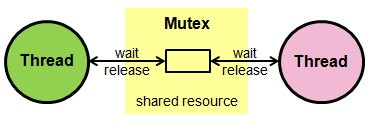

# graphcool-mutex

Mutex helper library for Graphcool

## Background

If you execute multiple GraphQL mutations, they are processed by the server in parallel.
Sometimes however, you need to perform an operation on these mutations that needs to happen sequentially.

For example, you want to update an auto-increment field in a pipeline hook, or you want to update a totals field on a parent node.

In these cases, you need a mechanism to make sure these operations are executed sequentially. This library implements the Mutex pattern to achieve this.



Each of the parallel operations (threads) requests a Mutex lock. When the lock does not exist yet, it is acquired immediately. If a lock already exists, the `acquire` method will wait for the lock to be released by the currently active operation. This ensures all operations are executed sequentially.

> The Mutex is **not** a database lock. It does **not** prevent any mutations against your data. It only halts execution of the operation that tries to acquire a lock.

## Installation

Using this library requires a Type on your Graphcool project with the following schema:

```graphql
type Mutex implements Node {
  id: ID! @isUnique
  name: String! @isUnique
}
```

## Usage

Import the library into your Graphcool function.
```js
const { withMutex } = require('@agartha/graphcool-mutex')
```

Wrap your `graphcool-lib` initialization with `withMutex`
```js
const graphcool = await withMutex(fromEvent(event))
```

Optionally, you can specify your project region manually, to avoid the async call:
```js
const graphcool = withMutex(fromEvent(event), 'EU_WEST_1')
```

Use the following syntax to acquire a Mutex lock:
```js
await graphcool.mutex.acquire('__MUTEX_NAME__')
```

Use the following syntax to release the lock:
```js
graphcool.mutex.release('__MUTEX_NAME__')
```
